# Time
A very simple educative game project developed during my Bachelor studies, aiming to teach kindergarten children the concept of time. It is a **plain HTML + CSS + JavaScript** project since it was designed to be easily started and run on any machine with a browser by any kindergarten child.

## Application overview
This application is, as previously said, **an educative game designed for kindergarten children** in order to teach them the concept of time through various interactive lessons and games. While playing the game, the child is accompanied by a **friendly narrator, Leo the Cat**, which gives instructions and narrates lessons (only in the Romanian language, since it was designed specifically for a romanian kindergarden from Cluj-Napoca).

The game is structured in **4 parts**, and each of these parts is split into **two sections: a lesson section and a game section** (the latter being accessible only if the former has been completed). Each part of the game teaches the child a different aspect related to the concept of Time, and then assesses his understanding through some interactive games:
* Part 1:
  - lesson about time measurement instruments & the times of the day ;
  - game consisting of questions asking which of the presented time measurement instruments can be used to measure / determine the length or the moment of certain actions.
* Part 2:
  - lesson about numbers and easy mathematical operations (additions and subtractions) with time measurement instruments;
  - game consisting of easy mathematical operations (additions and subtractions) with time measurement instruments, with 3 predefined answers.
* Part 3:
  - lesson about the days of the week and the months of the year, and specific things to each day and each month;
  - game where the child needs to order a few days of the week or months of the year in a correct chronological order using drag & drop functionality, and also correctly assemble parts of some words representing days of the week or months of the year using a similar drag & drop functionality.
* Part 4:
  - lesson about the seasons of the year (according to the romanian Climate) and specific things for each of these seasons;
  - game where the child needs to fill in the missing part of a sentence with the appropriate word denoting one of the four seasons of the year represented by images.

## How to start the application
To start the application, simply clone the repository and open the "main.html" file in a browser.

## Screenshots
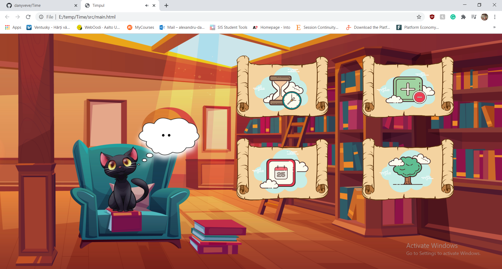
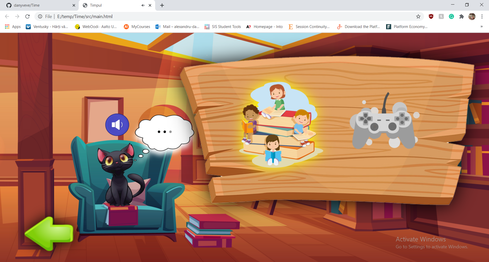
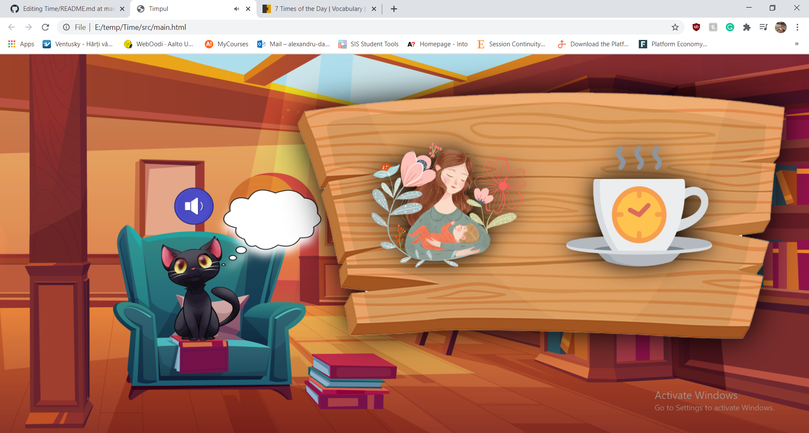
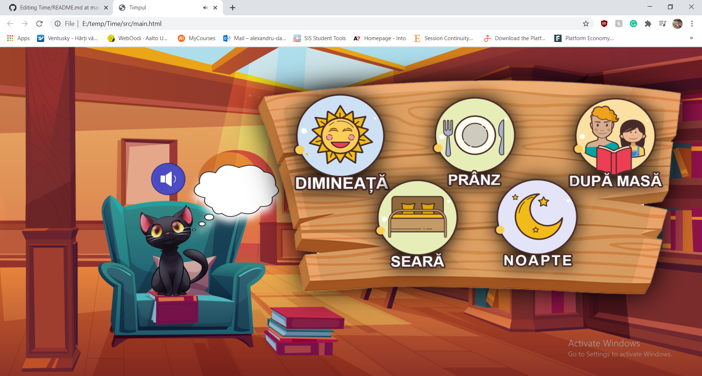
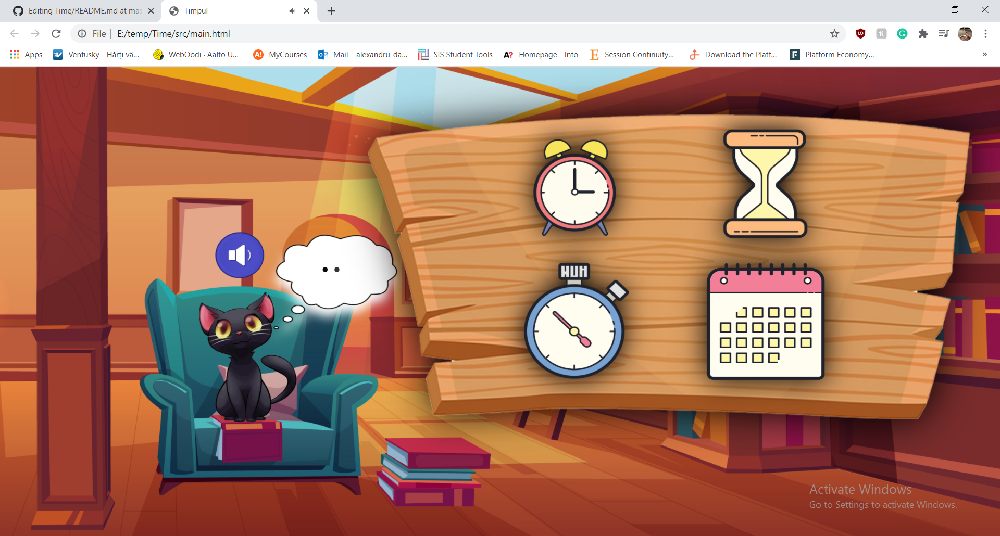
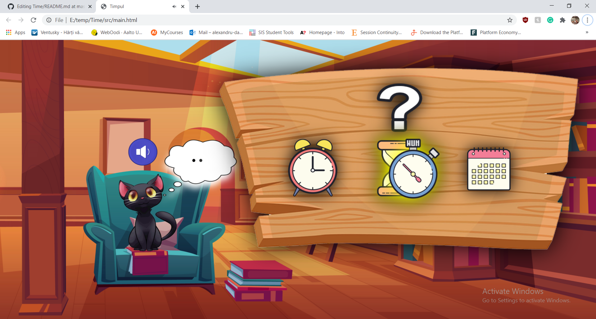
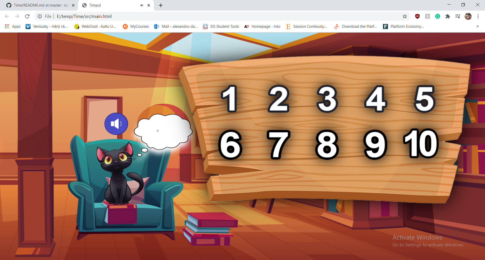
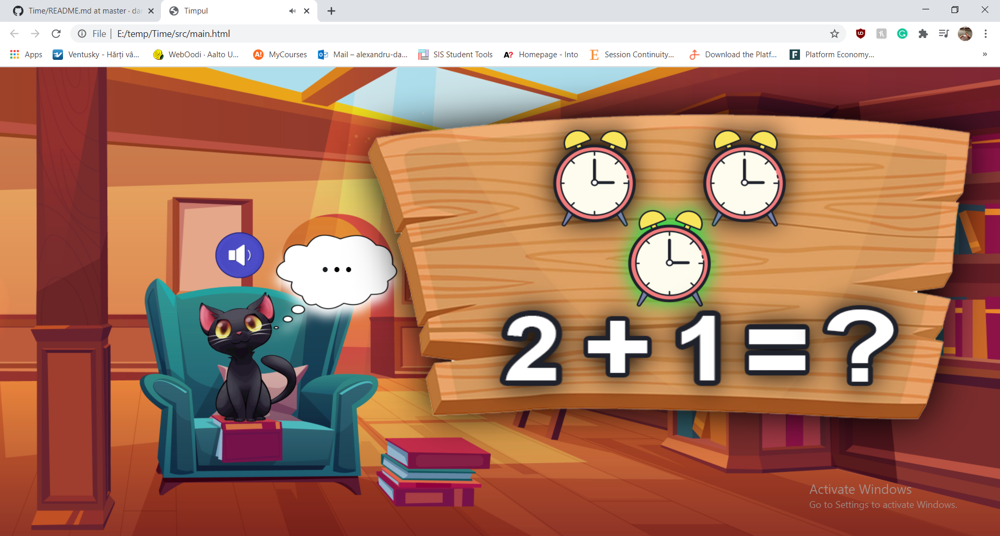
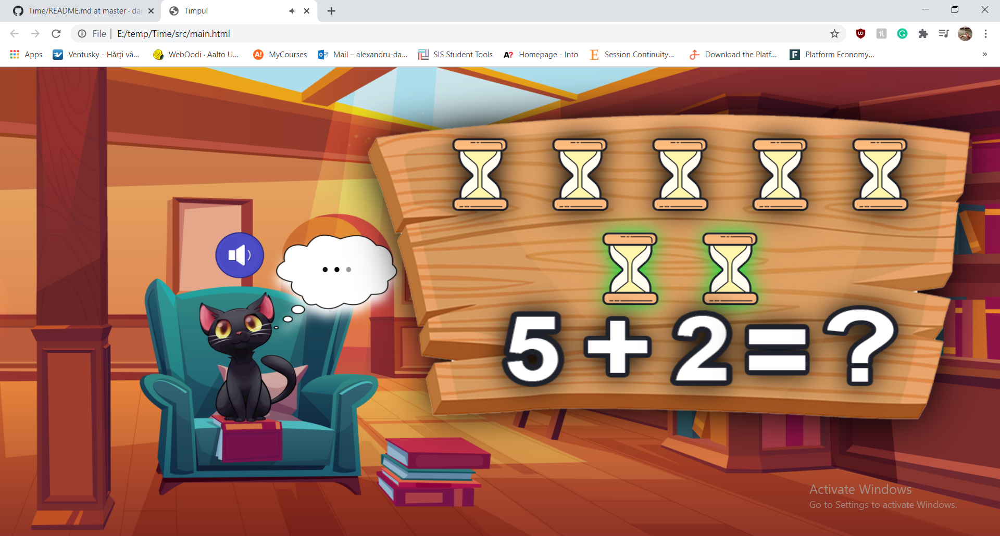
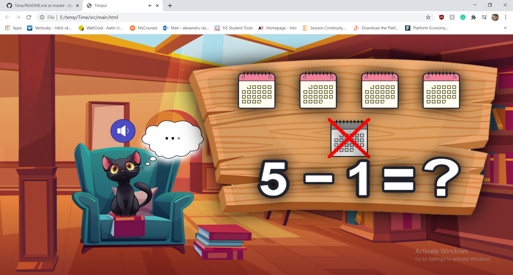
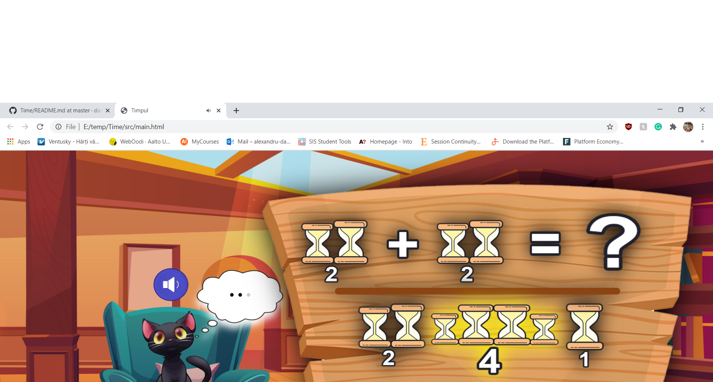
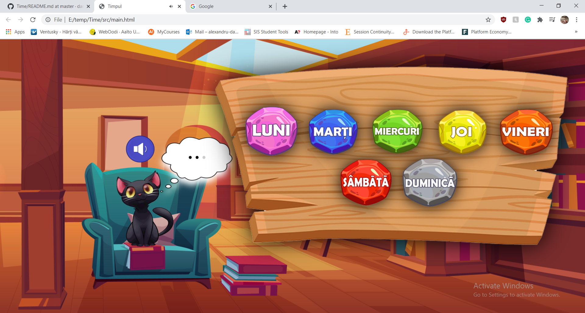
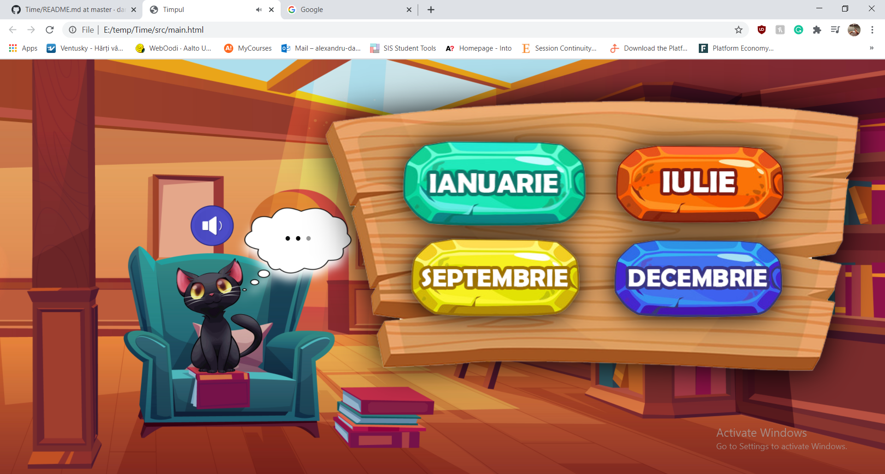
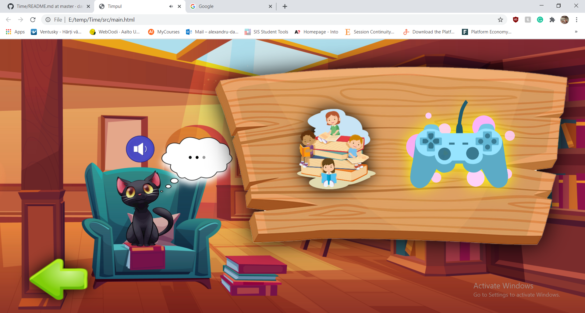
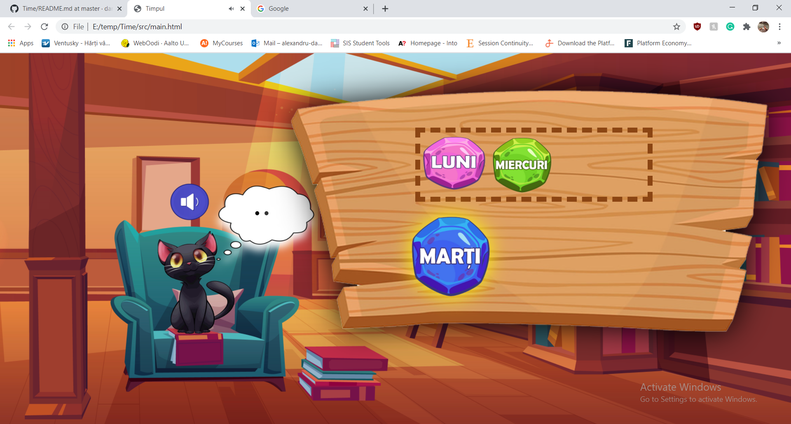
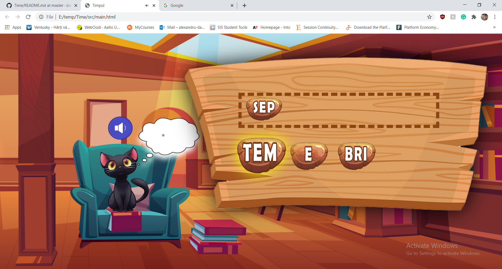
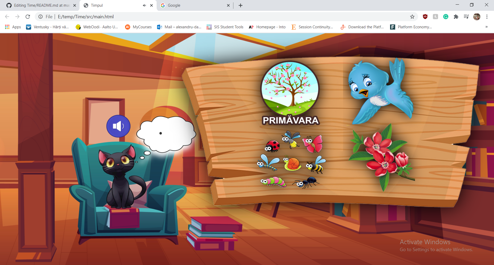
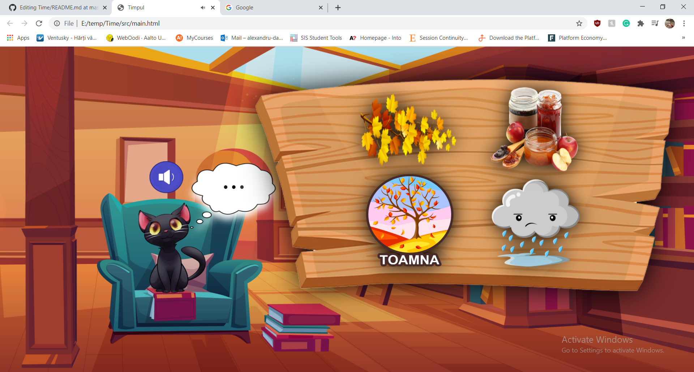
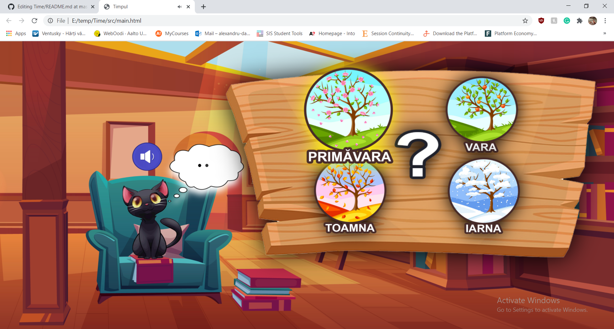
